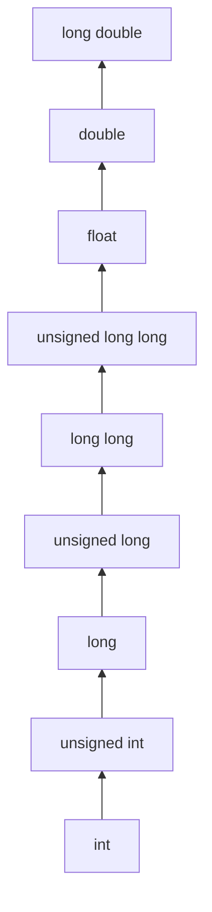

## 说明

- 教程来源看[教程](#教程)部分；
- 因为只为学习算法，不详细解释概念，所以并不详尽，详细还是转[教程](#教程)部分


## 教程

- [牛客网](https://www.nowcoder.com/tutorial/10002/8f7c3e0e7efd441d8f7c9c8d43c2a0f4)


## 编辑器

- [vim](https://www.vim.org/)
- [Visual Studio Code](https://code.visualstudio.com/)

> 没有使用 vim 的理由则使用 VS Code；
>
> 学习 vim：
>
> - Normal 模式下 `:help <command>` 然后 `Enter`。
> - [Vim help files](https://vimhelp.org/)


## 环境设置

- [GCC on Windows](https://code.visualstudio.com/docs/cpp/config-mingw)
- 如果不使用 VS Code，忽略插件部分即可，或者直接访问 [MSYS2](https://www.msys2.org/)


## 程序结构

```c
#include <stdio.h>

// 必须包含 main() ，从 main() 开始执行
int main()
{
   printf("Hello, World! \n");
   return 0;
}
```


## 编译说明

Windows 下：

- `-fexec-charset=gbk`：支持中文
- `-o`：输出，默认为 `a.exe`

```shell
$ gcc -fexec-charset=gbk [c文件.c] -o [输出文件.exe]
```


## 数组

### 数组声明与定义

```c
// type arraryName [ arraySize ] 
double balance[10];
```


### 数组初始化

```c
double balance[5] = { 1000.0, 2, 3.14, 5.0, 2.0 };
double balance[] = { 1000.0, 2, 3.14, 5.0, 2.0 }; // arraySize 为初始化时的数量

balance[0] = 10; // 第 1 个赋值为 10
```


## 字符串

> 在 C 语言中，字符串实际上是使用 **null** 字符 '\0' 终止的一维字符数组。因此，一个以 null 结尾的字符串，包含了组成字符串的字符。


### 字符串声明与定义

```c
char varName[ charSize ];
```


### 字符串初始化

- 字符串常量末尾无需添加 `\0`，编译器会在初始化时，自动把 `\0` 添加到字符串的末尾。

```c
char greeting[6] = {'H', 'e', 'l', 'l', 'o', '\0'};
char greeting[] = "Hello";
```


### 字符串的常用函数

- `#include <string.h>`

|        函数        |                             目的                             |
| :----------------: | :----------------------------------------------------------: |
| **strcpy(s1, s2)** |                 复制字符串 s2 到字符串 s1。                  |
| **strcat(s1, s2)** |              连接字符串 s2 到字符串 s1 的末尾。              |
|   **strlen(s1)**   |                    返回字符串 s1 的长度。                    |
| **strcmp(s1, s2)** | 如果 s1 和 s2 是相同的，则返回 0；如果 s1<s2 则返回小于 0；如果 s1>s2 则返回大于 0。 |
| **strchr(s1, ch)** |  返回一个指针，指向字符串 s1 中字符 ch 的第一次出现的位置。  |
| **strstr(s1, s2)** | 返回一个指针，指向字符串 s1 中字符串 s2 的第一次出现的位置。 |


## 枚举

### 枚举类型声明和定义

```c
// enum 枚举名 { 枚举1, 枚举2, ... }
// MON 赋值为 1 ，后续枚举在前一个成员的基础上 +1
enum DAY {
    MON=1, TUE, WED, THU, FRI, SAT, SUN
};

// 第 1 位 默认为 0，后续枚举在前一个成员的基础上 +1
// spring 为 0
enum season {
	spring, summer=2, autumn, winter
};

```


### 枚举变量的声明和定义

```C
// 先定义枚举类型，再定义变量
enum DAY {
    MON=1, TUE, WED, THU, FRI, SAT, SUN
};
enum DAY day;

// 定义枚举类型的同时定义变量
enum DAY {
    MON=1, TUE, WED, THU, FRI, SAT, SUN
} day;

// 省略枚举名称
enum {
    MON=1, TUE, WED, THU, FRI, SAT, SUN
} day;
```


### 枚举遍历

> 在C 语言中，枚举类型是被当做 int 或者 unsigned int 类型来处理的，所以按照 C 语言规范是没有办法遍历枚举类型的。

但是如果枚举是**连续的数**，则可以有条件遍历：

```v
#include <stdio.h>

enum DAY {
    MON=1, TUE, WED, THU, FRI, SAT, SUN
} day;

int main() {
    for (day = MON; day <= SUN; day ++){
        printf("枚举元素：%d", day);
    }
    return 0;
}
```


### 整数转换为枚举

```c
#include <stdio.h>
#include <stdlib.h>

int main()
{

    enum day
    {
        saturday,
        sunday,
        monday,
        tuesday,
        wednesday,
        thursday,
        friday
    } workday;

    int a = 1;
    enum day weekend;
    weekend = ( enum day ) a;  //类型转换
    //weekend = a; //错误
    printf("weekend:%d",weekend);
    return 0;
}
```


## 指针

### 变量地址

- `&变量名`

```c
#include <stido.h>

int main() {
    int var1;
    char var2[10];
    
    printf("变量 var1 的地址：%p\n", &var1);
    printf("变量 var2 的地址：%p\n", &var2);
    
    return 0;
}
```


### 指针

- 指针是变量，其值为另一个变量的地址


### 指针声明与定义

- 指针声明的数据类型不同，只是因为指向的变量的值的数据类型不同
- 指针值的类型都是代表内存地址的长的十六进制数

```c
// type *varName;
int *p;
double *p;
float *p;
char *p;
```


### 指针的使用

```c
int var = 20;   // 实际变量的声明
int *ip;        // 指针变量的声明
ip = &var;  // 在指针变量中存储 var 的地址
printf("Value of *ip variable: %d\n", *ip ); // 使用指针访问值
```


### NULL 指针

`int *p = NULL;` 将指向地址 ` 0x0`，该地址程序为系统保留，不允许程序访问。

检查指针是否为空指针：

```c
if(ptr)     // 如果 p 非空，则完成
if(!ptr)    // 如果 p 为空，则完成
```


## 函数指针

- 指向函数的指针


### 函数指针声明

```c
// typedef int (*funName)(int,int);
```

```c
#include <stdio.h>

int max(int x, int y)
{
    return x > y ? x : y;
}

int main(void)
{
    /* p 是函数指针 */
    int (* p)(int, int) = & max; // &可以省略
    int a, b, c, d;

    printf("请输入三个数字:");
    
    /* scanf() 函数要改变变量的值，就需要传进地址 */
    scanf("%d %d %d", & a, & b, & c);

    /* 与直接调用函数等价，d = max(max(a, b), c) */
    d = p(p(a, b), c); 

    printf("最大的数字是: %d\n", d);

    return 0;
}
```


### 回调函数

- 把一个函数的指针当作参数传递给该函数执行

```c
#include <stdlib.h>  
#include <stdio.h>

// 回调函数
void populate_array(int *array, size_t arraySize, int (*getNextValue)(void))
{
    for (size_t i=0; i<arraySize; i++)
        array[i] = getNextValue();
}

// 获取随机值
int getNextRandomValue(void)
{
    return rand();
}

int main(void)
{
    int myarray[10];
    populate_array(myarray, 10, getNextRandomValue);
    for(int i = 0; i < 10; i++) {
        printf("%d ", myarray[i]);
    }
    printf("\n");
    return 0;
}
```


## 结构体

- 存储不同类型的数据项


### 定义结构

```c
/*
struct [标签] { 
    变量定义1;
    变量定义2;
    变量定义3;
    ...
} [结构变量];
*/
```

标签、变量定义和结构变量，三者最少要出现两个：

```c
//此声明声明了拥有3个成员的结构体，分别为整型的a，字符型的b和双精度的c
//同时又声明了结构体变量s1
//这个结构体并没有标明其标签
struct 
{
    int a;
    char b;
    double c;
} s1;

//此声明声明了拥有3个成员的结构体，分别为整型的a，字符型的b和双精度的c
//结构体的标签被命名为SIMPLE,没有声明变量
struct SIMPLE
{
    int a;
    char b;
    double c;
};
//用SIMPLE标签的结构体，另外声明了变量t1、t2、t3
struct SIMPLE t1, t2[20], *t3;

//也可以用typedef创建新类型
typedef struct
{
    int a;
    char b;
    double c; 
} Simple2;
//现在可以用Simple2作为类型声明新的结构体变量
Simple2 u1, u2[20], *u3;
```


### 结构体变量初始化

```c
#include <stdio.h>

struct Books
{
   char  title[50];
   char  author[50];
   char  subject[100];
   int   book_id;
} book = {"C 语言", "NOWCODER", "编程语言", 123456};

int main()
{
    printf("title : %s\nauthor: %s\nsubject: %s\nbook_id: %d\n", book.title, book.author, book.subject, book.book_id);
}
```


### 访问结构体成员

```c
struct Books
{
   char  title[50];
   char  author[50];
   char  subject[100];
   int   book_id;
} book = {"C 语言", "NOWCODER", "编程语言", 123456};

// 成员访问运算符 .
int main() {
    printf("%s\n", book.title);
    return 0;
}
```


### 结构体作为函数参数

```c
#include <stdio.h>
#include <string.h>

struct Books
{
   char  title[50];
   char  author[50];
};

void printBook(struct Books book)
    
int main() {
    struct Books book;
    strcpy(book.title, "main");
    strcpy(book.author, "test");
    printBook(book); // 传参
    return 0;
}

void printBook(struct Books book){
    printf("title：%s\n", book.title);
}
```


### 指向结构体的指针

声明和定义和其他类型的指针一样：

```c
#include <stdio.h>

struct Books
{
   char  title[50];
   char  author[50];
} book = {'t', 'a'};

void printBook(struct Book *p);

int main(){
    printfBook( &book ); // 传址
    return 0;
}

void printBook(struct Book *p){
    printf('tittle：%s\n', p->tittle); // 访问结构体成员
    printf('author：%s\n', p->author); // 访问结构体成员
}
```


## 位域

- 位域在本质上就是一种结构类型，不过其成员是按二进位分配的

> 有些信息在存储时，并不需要占用一个完整的字节，而只需占几个或一个二进制位。例如在存放一个开关量时，只有 0 和 1 两种状态，用 1 位二进位即可。为了节省存储空间，并使处理简便，C 语言又提供了一种数据结构，称为"位域"或"位段"。


### 定义位域

```
struct
{
  type [member_name] : width ; // 位域内的声明
};
```

一个位域存储在同一个字节中，如一个字节所剩空间不够存放另一位域时，则会从下一单元起存放该位域。也可以有意使某位域从下一单元开始。例如：

```c
struct bs{
    unsigned a:4;
    unsigned  :4;    /* 空域 */
    unsigned b:4;    /* 从下一单元开始存放 */
    unsigned c:4
}
```


### 位域的使用

```c
/*
位域变量名.位域名
位域指针变量名->位域名
*/
```


## 共用体

- 允许在相同的内存位置存储不同的数据类型
- 可以定义一个带有多成员的共用体，但是**任何时候只能有一个成员带有值**
- 共用体占用的内存应足够存储共用体中最大的成员
- 共用体提供了一种使用相同的内存位置的有效方式


### 定义共用体

```
union [union tag] // [union tag] 同样可以省略
{
   member definition;
   member definition;
   ...
} [one or more union variables];
```

```c
union Data
{
   int i;
   float f;
   char  str[20]; // str 占用的内存空间最大。printf("data 的内存空间：%d\n", sizeof(data))，但还需遵循地址对齐的规定
} data;
```


### 访问共用体成员

```c
#include <stdio.h>
#include <string.h>

union Data
{
   int i;
   float f;
   char  str[20];
};

int main( )
{
   union Data data;        

   // str 最后被赋值，占用了 i 和 f 的内存空间
   data.i = 10;
   data.f = 220.5;
   strcpy( data.str, "C Programming");

   printf( "data.i : %d\n", data.i);
   printf( "data.f : %f\n", data.f);
   printf( "data.str : %s\n", data.str);

   return 0;
}
```


## typedef

### 为类型取名

```c
typedef unsigned char BYTE;
// BYTE  b1, b2;
```

命名一个结构体为新的数据类型：

```c
typedef struct Books
{
   char  title[50];
   char  author[50];
   char  subject[100];
   int   book_id;
} Book;

Book book;
```


### typedef vs #define

- **typedef** 仅限于为类型定义符号名称，**#define** 不仅可以为类型定义别名，也能为数值定义别名，比如您可以定义 1 为 ONE。
- **typedef** 是由编译器执行解释的，**#define** 语句是由预编译器进行处理的。


## 输入输出

C 语言把所有的设备都当作文件。所以设备（比如显示器）被处理的方式与文件相同。以下三个文件会在程序执行时自动打开，以便访问键盘和屏幕。

| 标准文件 | 文件指针 |   设备   |
| :------: | :------: | :------: |
| 标准输入 |  stdin   |   键盘   |
| 标准输出 |  stdout  |   屏幕   |
| 标准错误 |  stderr  | 您的屏幕 |

### scanf() 与 printf()

- `%d`： 格式化输出整数
- `%f`： 格式化输出浮点型数据


### getchar() 与 putchar()

**int getchar(void)** 函数从屏幕读取下一个可用的字符，并把它返回为一个整数。这个函数在同一个时间内只会读取一个单一的字符。您可以在循环内使用这个方法，以便从屏幕上读取多个字符。

**int putchar(int c)** 函数把字符输出到屏幕上，并返回相同的字符。这个函数在同一个时间内只会输出一个单一的字符。您可以在循环内使用这个方法，以便在屏幕上输出多个字符。


### gets() 与 puts()

**char \*gets(char \*s)** 函数从 **stdin** 读取一行到 **s** 所指向的缓冲区，直到一个终止符或 EOF。

**int puts(const char \*s)** 函数把字符串 s 和一个尾随的换行符写入到 **stdout**。


## 强制类型转换

- 注意隐式转换


### 整数提升

- 整数提升是指把小于 **int** 或 **unsigned int** 的整数类型转换为 **int** 或 **unsigned int** 的过程。

```c
#include <stdio.h>

int main()
{
   int  i = 17;
   char c = 'c'; // ascii 值是 99
   int sum;

   sum = i + c; // i + 99
   printf("Value of sum : %d\n", sum );

}
```


### 常用的算数转换

**常用的算术转换**是隐式地把值强制转换为相同的类型。编译器首先执行**整数提升**，如果操作数类型不同，则它们会被转换为下列层次中出现的最高层次的类型：



